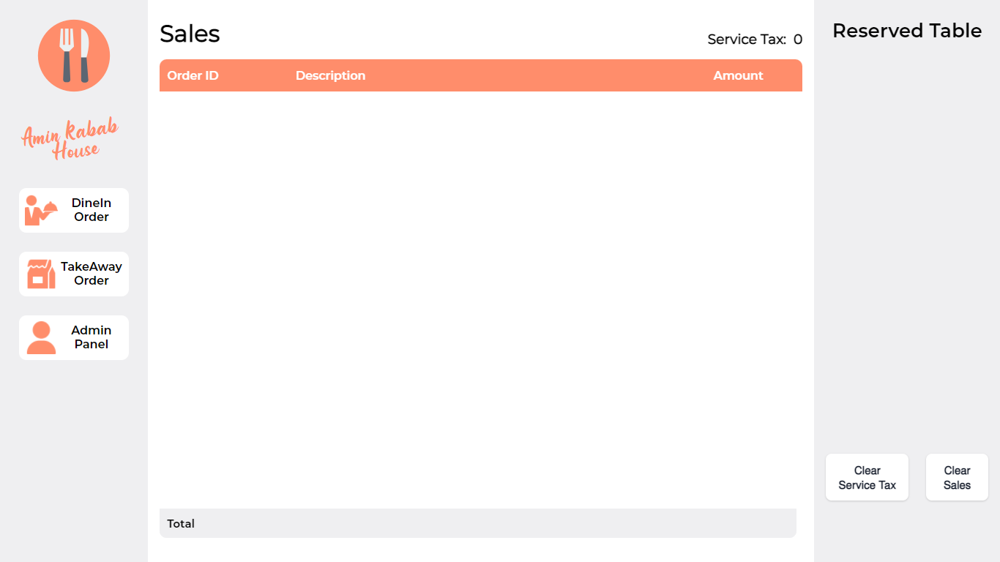
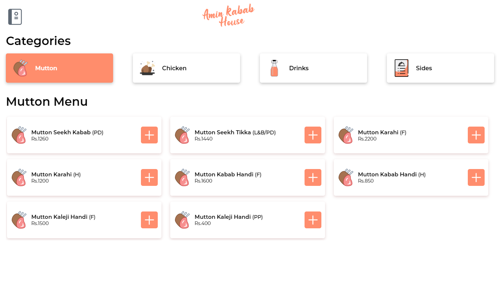
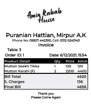
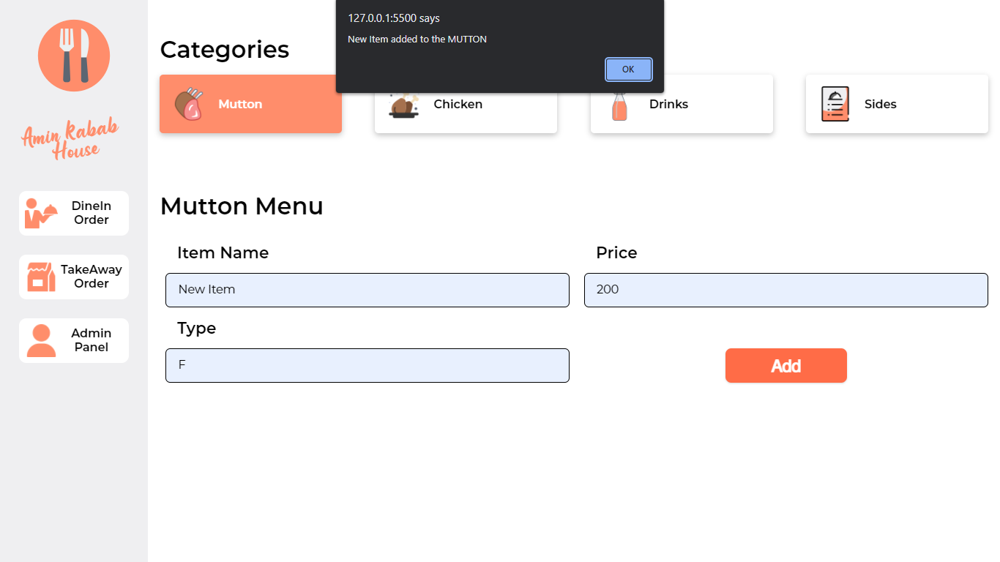

# Restaurant Invoice Desktop App

## Table of contents

- [Overview](#overview)
  - [Introduction](#introduction)
  - [Screenshot](#screenshot)
  - [Links](#links)
- [My process](#my-process)
  - [Built with](#built-with)
  - [What I learned](#what-i-learned)
  - [Useful resources](#useful-resources)
- [Author](#author)
- [Acknowledgments](#acknowledgments)

## Overview

### Introduction

It is a simple invoice desktop app having the following features:

- Order Creation
  - Take Away
  - Dine In Order
    - Table Reserve
    - Order Update
- Silent Printing
- Sales Table
- Menu Update

### Screenshot

### Links

- Download Win64: [Restaurant-Invoice-Desktop-App-Win64](https://drive.google.com/file/d/1FpEXEDx5P1FBeqsxu5fW9yYd0YhqrJOO/view?usp=sharing)
- Download Win32: [Restaurant-Invoice-Desktop-App-Win32](https://drive.google.com/file/d/1RDF2dbd5aEDr6xpgyzc3_0dsc4T_-lyY/view?usp=sharing)
- Live Site URL: [Restaurant-Invoice-Desktop-App](https://restaurant-invoice.vercel.app/index.html) (Note: It will just show the demo for properly working you have to download it.)

## My process

- UI Design in AdobeXD
- Create the frontend
- Add Magic i.e., JavaScript
- DataBase for Menu Addition
- Store Sales in DataBase

### Built with

- Semantic HTML5 markup
- CSS custom properties
- Flexbox
- CSS Grid
- SCSS
- Desktop-workflow
- IndexedDB
- JavaScript [Imperative Programming]
- LocalStorage & SessionStorage
- NW.js

#### NW.js

NW.js (previously known as node-webkit) lets you call all Node.js modules directly from DOM and enables a new way of writing applications with all Web technologies.
Using this library, I easily implemented the Silent printing feature.
Link is mentioned in the useful resources section.

### What I learned

I learned alot of things but the most important thing which i learned is understanding the need of framework/library.
To tackle a single button, one has to imperative coding handling all the situtations.
I also learned about IndexedDB which is alot more poweful than LocalStorage.

### Useful resources

- Node Webkit - [NW.js](https://nwjs.io/)
- IndexedDB - [IDB](https://javascript.info/indexeddb)

## Author

- Frontend Mentor - [@MohtashimAli85](https://www.frontendmentor.io/profile/MohtashimAli85)
- LinkedIn - [@MohtashimAli](https://www.linkedin.com/in/mohtashim-ali-698720194/)
